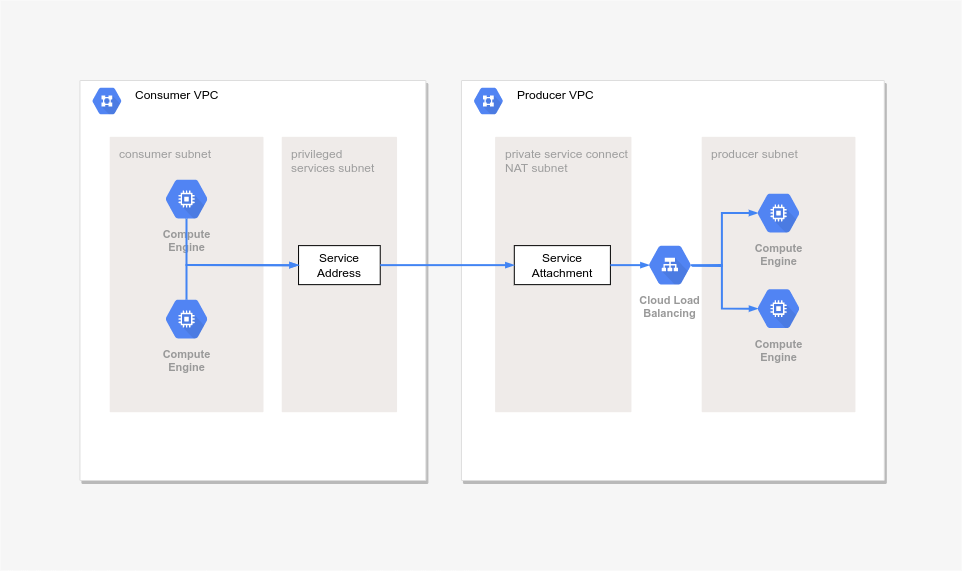

= GCP Private Service Connect Demo

This folder contains terraform config to provision a demonstration environment for Google Cloud Platform Private Service Connect with the following architecture:

Egress firewall rules are used to allow only selected resources to access the private service connect.

== Prerequisites
. 2 GCP projects with Compute Engine API and Identity Aware Proxy API enabled.
. Terraform

== Steps
. Clone the top level project and change to this directory
+
[source,bash]
----
git clone https://github.com/naikoob/gcp-demospace.git
cd gcp-demospace/demospace/private-service-connect
----
. Initialize terraform providers and plugins
+
[source,bash]
----
terraform init
----
. Provide your GCP organization, billing account and an existing folder to provision via terraform like so: 
+ 
[source, bash]
----
terraform apply -var 'organization=<your-oranization-name>' -var 'billing_account_name=<your-billing-account-name>' -var 'demo_folder=<your-google-cloud-folder>'
----
* Note: it takes a few mins to enable the APIs required for the projects, so you may need to re-run the above if it does not complete successfully.

. An IP address `10.1.20.100` will be assigned in the consumer VPC to connect to the service attachment published on the producer VPC
. 2 compute instances will be created in the consumer VPC network - `psc-access-vm` and `test-vm`
. `psc-access-vm` is using the `psc-access-sa@` service account, and will be able to access the connected service. Demonstrate by using curl in a SSH session:
+
[source, bash]
----
curl -v 10.1.20.100
----
. `test-vm` on the other hand is using the default compute engine service account, and will not be able to access the connected service.
